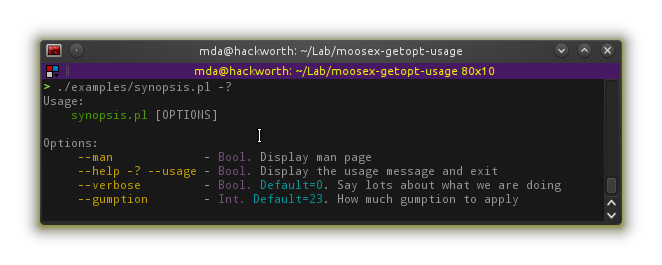
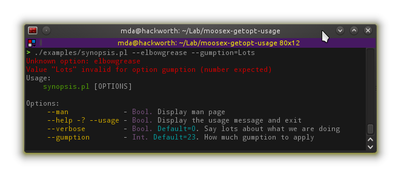

MooseX::Getopt::Usage
=====================

Extend [MooseX::Getopt](https://metacpan.org/pod/MooseX::Getopt) with (colour) usage message and man page generated from attribute meta and POD.

SYNOPSIS
--------

```perl

    ## In your class
    package My::App;
    use Moose;

    with 'MooseX::Getopt::Usage',
         'MooseX::Getopt::Usage::Role::Man';

    has verbose => ( is => 'ro', isa => 'Bool', default => 0,
        documentation => qq{Say lots about what we are doing} );

    has gumption => ( is => 'rw', isa => 'Int', default => 23,
        documentation => qq{How much gumption to apply} );

    # ... rest of class

    ## In your script
    #!/usr/bin/perl
    use My::App;
    my $app = My::App->new_with_options;
```

Can now get help,



trap errors with usage,



and get a man page:

```
 $ synopsis.pl --man
```

SEE ALSO
--------

See [the README](README) for install instructions, [the METACPAN page](https://metacpan.org/pod/MooseX::Getopt::Usage) for latest release docs.
